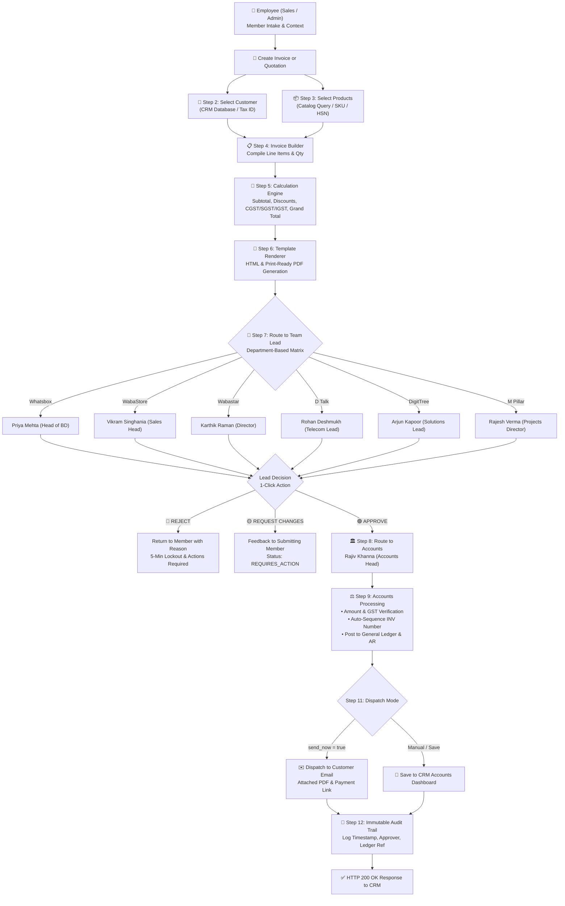

# Amuwa CRM - n8n Automation Pipeline
## "Invoice & Quotation Management - Multi-Approval Pipeline"

This document provides complete documentation and technical specifications for the automated **Invoice & Quotation Management Pipeline** built for **Amuwa CRM OS** and the **Accounts Department**.

---

## 1. Flowchart & Pipeline Architecture

The workflow implements the entire intake, calculation, and approval routing chain:



---

## 2. Department Approval Matrix

The workflow automatically matches the submitting employee's department and routes actionable notifications with embedded 1-click decision webhooks:

| Department | Designated Team Lead | Lead Email | Escalation SLA |
| :--- | :--- | :--- | :--- |
| **Whatsbox** | Priya Mehta | `priya.mehta@amuwa.com` | 24 Hours (Daily 9AM Cron) |
| **WabaStore** | Vikram Singhania | `vikram.s@wabastore.com` | 24 Hours (Daily 9AM Cron) |
| **Wabastar** | Karthik Raman | `karthik.r@wabastar.com` | 24 Hours (Daily 9AM Cron) |
| **D Talk Corporation** | Rohan Deshmukh | `rohan.d@dtalk.com` | 24 Hours (Daily 9AM Cron) |
| **Digitree Infotech** | Arjun Kapoor | `arjun.k@digitree.com` | 24 Hours (Daily 9AM Cron) |
| **M Pillar Corporation** | Rajesh Verma | `rajesh.v@mpillar.com` | 24 Hours (Daily 9AM Cron) |
| **Corporate Accounts** | Rajiv Khanna (Accounts Head) | `accounts@wabastore.com` | Immediate Ledger Posting |

---

## 3. Step-by-Step Technical Execution

### Step 1: Employee Intake
* **Input:** `{ memberId, name, email, department, role, type: 'INVOICE' | 'QUOTATION' }`
* **Source:** Authenticated user session from Amuwa CRM.
* **Logic:** Normalizes department ID (e.g. `wabastore`, `whatsbox`, `dtalk`, `digitree`, `mpillar`).

### Step 2: Customer Selection
* **Input:** Customer selection `{ customerId, customerName, company, email, phone, address, taxId, paymentTerms }`
* **Logic:** Resolves against internal corporate customer database. Determines **Intra-State** (CGST 9% + SGST 9%) vs **Inter-State** (IGST 18%) tax rules automatically based on customer's state.

### Step 3: Product Catalog Query
* **Input:** Array of `{ productId, quantity }`
* **Catalog:** Queries master catalog for official SKU, SAC code (`998314`, `998413`), base rate, and GST rate. Validates that unit prices do not fall below company minimum margins.

### Step 4 & 5: Calculation Engine
* **Calculations:**
  $$\text{Subtotal} = \sum (\text{Qty} \times \text{Rate})$$
  $$\text{Taxable Amount} = \text{Subtotal} - \text{Discount}$$
  $$\text{CGST} = \text{Taxable} \times 9\% \quad (\text{if intra-state})$$
  $$\text{SGST} = \text{Taxable} \times 9\% \quad (\text{if intra-state})$$
  $$\text{IGST} = \text{Taxable} \times 18\% \quad (\text{if inter-state})$$
  $$\text{Grand Total} = \text{Taxable Amount} + \text{Total GST}$$
* **Output:** Precise numeric totals and formal Indian English words (`Rupees Fifty-Four Thousand Only`).

### Step 6: Template Renderer
* Generates a corporate, print-ready HTML document compliant with **Section 31 of CGST Act, 2017**:
  * Corporate Header with GSTIN `27AABCA9918K1ZB` & CIN `U72200MH2024PTC18820`.
  * Document Title: `TAX INVOICE` or `OFFICIAL COMMERCIAL QUOTATION`.
  * Bill-To & Commercial Origin cards.
  * Itemized line-item table with SAC/HSN codes.
  * Formal calculation breakdown box.
  * HDFC Bank Corporate coordinates (`Current A/C #50200088991122`, `IFSC: HDFC0000182`).
  * Authorized signature block for Accounts Head.

### Step 7: Team Lead Approval Workflow
* Generates secure 1-click action URLs:
  * `APPROVE`: `https://<n8n-domain>/webhook/amuwa-invoice-approval-callback?action=APPROVE&docId=INV-WABA-2026-XXXX&token=...`
  * `REQUEST_CHANGES`: `https://<n8n-domain>/webhook/amuwa-invoice-approval-callback?action=REQUEST_CHANGES&docId=INV-WABA-2026-XXXX...`
  * `REJECT`: `https://<n8n-domain>/webhook/amuwa-invoice-approval-callback?action=REJECT&docId=INV-WABA-2026-XXXX...`
* If **REJECT**: Returns to team member with rejection reason and enforces a 5-minute lockout period.
* If **REQUEST CHANGES**: Flags document as `REQUIRES_ACTION` with feedback.
* If **APPROVE**: Moves directly to Accounts Department.

### Step 8 & 9: Accounts Department Processing
* **Automated Audit Checks:**
  1. Amount check: Grand total $> 0$.
  2. Customer check: GSTIN and Company verified.
  3. Price floor check: Minimum billing rate validated.
  4. Tax split check: Correct 18% GST distribution.
* **General Ledger Booking:**
  * Auto-generates sequential ledger transaction number (`ACCTS-AMW-XXXXXX`).
  * Posts to **Accounts Receivable (AR)** debit account with customer tax ID and payment terms.
  * Credits `1001-SALES-REVENUE`.
  * Status set to `PROCESSED`.

### Step 10 & 11: Output & Customer Delivery
* Provides live HTML preview URL and PDF download endpoint.
* If `send_now === true`: Dispatches email directly to client with attached PDF.

### Step 12: Immutable Audit Trail
* Generates permanent timestamped log:
```json
{
  "invoiceId": "INV-WABA-2026-4491",
  "documentType": "INVOICE",
  "createdBy_memberId": "EMP-1001",
  "createdAt": "2026-10-02T15:10:00Z",
  "approvedBy_leadId": "LEAD-WBS-01",
  "approvedAt": "2026-10-02T15:11:15Z",
  "processedBy_accountsId": "ACC-HEAD-01",
  "processedAt": "2026-10-02T15:12:00Z",
  "generalLedgerRef": "ACCTS-AMW-781920",
  "status": "PROCESSED",
  "actions_log": [
    { "step": "EMPLOYEE_INTAKE", "status": "SUCCESS" },
    { "step": "CATALOG_CALCULATION", "amount": "₹2,95,000" },
    { "step": "TEAM_LEAD_APPROVAL", "status": "APPROVED", "approver": "Vikram Singhania" },
    { "step": "ACCOUNTS_VERIFICATION", "status": "VERIFIED_AND_POSTED", "ledgerRef": "ACCTS-AMW-781920" }
  ]
}
```

---

## 4. How to Import Workflow into n8n

1. Download or copy `invoice_quotation_pipeline_workflow.json` located at:
   * **Workspace:** `c:\Users\Shreya\Desktop\wabastore-sales-os-uiux-improved\n8n\invoice_quotation_pipeline_workflow.json`
2. In your n8n web app:
   * Click **Workflows** in the sidebar.
   * Click the top-right **Options menu ("...")** → **Import from File** (or press `Ctrl + I`).
   * Select `invoice_quotation_pipeline_workflow.json`.
3. Configure environment variables in n8n (Optional):
   * `N8N_WEBHOOK_URL`: Your public n8n domain URL (e.g. `https://n8n.yourcompany.com`).
4. Toggle **Active** to `ON` at the top right of the canvas.

---

## 5. Sample API / Webhook Test Payloads

### Test A: Create Invoice via Webhook
**POST** `https://<your-n8n-url>/webhook/amuwa-invoice-quotation-intake`

```json
{
  "type": "INVOICE",
  "memberId": "EMP-1001",
  "memberName": "Vikram Singhania",
  "memberEmail": "vikram.s@wabastore.com",
  "department": "wabastore",
  "role": "Head of Sales & Commercials",
  "customerId": "CUST-TITAN",
  "items": [
    {
      "productId": "PROD-WABA-01",
      "quantity": 1
    },
    {
      "productId": "PROD-WABA-02",
      "quantity": 3
    }
  ],
  "discount": {
    "type": "percentage",
    "value": 5
  },
  "send_now": false
}
```

### Test B: Create Quotation via Webhook
**POST** `https://<your-n8n-url>/webhook/amuwa-invoice-quotation-intake`

```json
{
  "type": "QUOTATION",
  "memberId": "EMP-WBX-01",
  "memberName": "Meera Nambiar",
  "memberEmail": "meera.n@whatsbox.com",
  "department": "whatsbox",
  "role": "Head of Business Development",
  "customerId": "CUST-FABINDIA",
  "items": [
    {
      "productId": "PROD-WBOX-01",
      "quantity": 1
    }
  ],
  "discount": {
    "type": "flat",
    "value": 15000
  },
  "send_now": true
}
```

### Test C: Team Lead Approval Action Webhook
**POST** `https://<your-n8n-url>/webhook/amuwa-invoice-approval-callback`

```json
{
  "action": "APPROVE",
  "docId": "INV-WABA-2026-4491",
  "approverEmail": "vikram.s@wabastore.com",
  "comments": "Commercial terms verified. Approved for Accounts processing."
}
```
